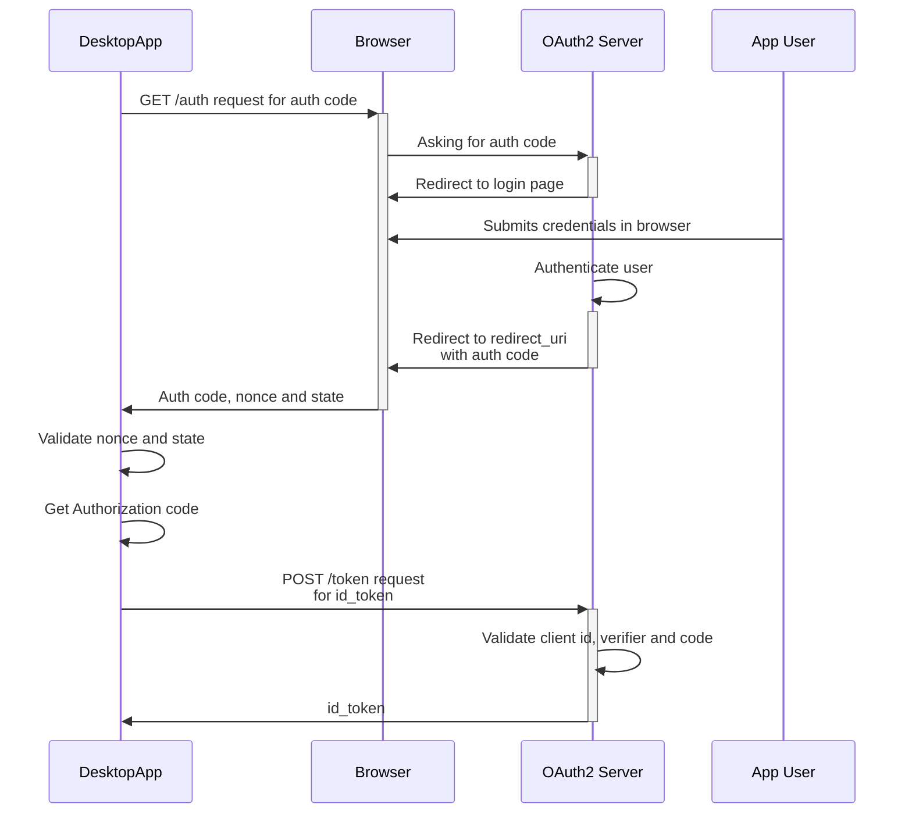

OAuth2 Token generation workflow from desktop app

```mermaid
sequenceDiagram 
    participant DA as DesktopApp
    participant web as Browser
    participant OAuth as OAuth2 Server
    participant AU as App User

    DA ->>+ web: GET /auth request for auth code
    web ->>+ OAuth: Asking for auth code
    OAuth ->>- web: Redirect to login page
    AU->>web: Submits credentials in browser
    OAuth->>+OAuth: Authenticate user
    OAuth->>-web: Redirect to redirect_uri <br> with auth code
    web->>-DA: Auth code, nonce and state
    
    DA->>DA: Validate nonce and state
    DA->>DA: Get Authorization code
    DA->>+OAuth: POST /token request <br> for id_token
    OAuth->>OAuth: Validate client id, verifier and code
    OAuth->>-DA: id_token

```